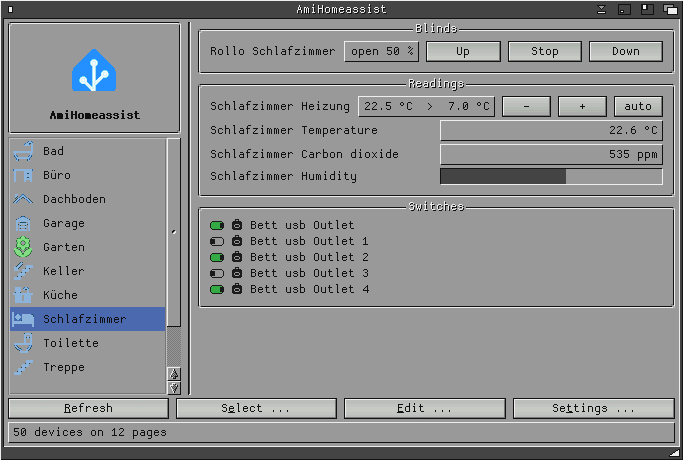

# AmiHomeassist

Control [Home Assistant](https://www.home-assistant.io/) from a real Amiga.
Lights, sockets, blinds, climate and sensors arranged on dashboards of your
own, with a MUI interface: dashboards in a sidebar on the left, the chosen
page on the right.



- AmigaOS 2.0+, 68020 or better, no FPU needed
- MUI 3.8+ with NList.mcc / NListview.mcc
- Any TCP/IP stack with `bsdsocket.library` (Roadshow, AmiTCP, Miami, ...)
- Home Assistant reachable over plain http, plus a long-lived access token
- English, Deutsch, Italiano, Español

**Download:** ready-to-run archives are on Aminet as
[comm/tcp/AmiHomeassist-0.6](https://aminet.net/package/comm/tcp/AmiHomeassist-0.6)
and under [Releases](../../releases).

The full user documentation (English and German) is in
[README.txt](README.txt), the version history in
[Changelog.txt](Changelog.txt).

## Building

Cross-compiled with [m68k-amigaos-gcc](https://github.com/AmigaPorts/m68k-amigaos-gcc):

```sh
make                 # AmiHomeassist + AmiHomeassistCLI
make check-fpu       # proves no FPU instruction is in the binaries
make TOOLCHAIN=/path/to/m68k-amigaos-gcc
```

MUI's own developer headers (`libraries/mui.h`, `proto/muimaster.h`,
`clib/muimaster_protos.h`, `inline/muimaster.h`) are **not** in this
repository - MUI's licence only allows redistributing the complete original
archive. Put them under `vendor/mui/include/`. The NList headers (LGPL) are
included in `mui/`.

`locale.py` builds the catalogues and `locale_strings.h` from `strings.cd`
and `catalogs/*.ct`; the header is committed, so a build works without
Python.

Note: `README.txt` is written for the Aminet archive, where the sources live
in a `Source` drawer. In this repository they are at the top level.

## History

This repository was created after the fact from the released Aminet
archives; each release is one commit, tagged `v0.5`, `v0.6`, `v0.7`.
0.5 was still built with SAS/C on the Amiga (`mk`), from 0.6 on it is
cross-compiled.

## Licence

MIT, see [LICENSE](LICENSE). `muistubs.c` comes from
[amimcp](https://github.com/thomas-luebker/amimcp) and is Apache 2.0
([LICENSE-Apache-2.0](LICENSE-Apache-2.0)). The icons are derived from
[Material Design Icons](https://github.com/Templarian/MaterialDesign) (Apache 2.0).

This program is vibe coded. I described what it should do, an AI wrote the
code, and I read, tested and decided what stayed in. The full source is here
so you can judge for yourself.

Author: radi7777 (radi777 on Aminet)
